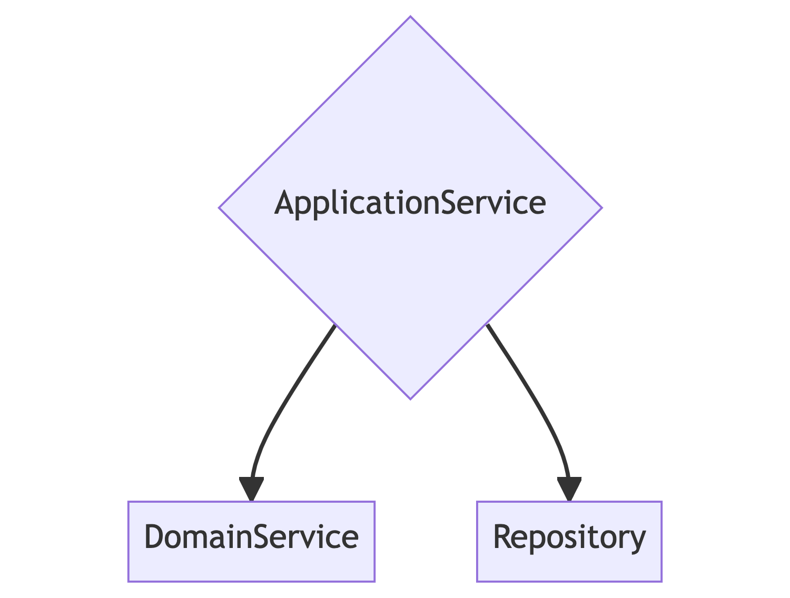

# 도메인 주도 개발 공부

레퍼런스

* 도메인 주도 설계 철저입문 (나루세 마사노부)

## 엔티티

속성이 아닌 동일성으로 식별되는 객체.
속성을 통해 식별되는 객체는 '값 객체' 이다.

* 가변이다.
* 속성이 같아도 구분할 수 있다.
* 동일성을 통해 구별된다.

> 시스템 사용자는 최초 사용자 등록 시에 자신의 개인정보를 사용자 정보로 등록한다. 사용자 정보는 대부분의 경우 임의로 수정할 수 있다. 그러나 사용자 정보로 등록된 데이터가 수정됐다고 해서 
> 해당 사용자가 다른 사용자가 되는 일은 없다. 사용자는 이름이 변경됐다 하더라도 사용자 정보가 수정된 것 뿐이지 사용자 자체가 수정된 것이 아니다.
> 이렇듯 사용자는 속성이 아닌 동일성(Identity) 으로 식별된다.

엔티티와 값 객체는 성질이 달라도 두가지 모두 도메인을 나타내는 **도메인 객체**다.

### 도메인 객체

> 자신을 위한 행동

도메인 객체의 행동이나 규칙을 코드로 작성했을 때의 두 번째 장점은 도메인에 일어난 변경을 코드에 반영하기 쉽다는 점이다.

예를 들어 도메인 규칙에 변경이 일어난 상황을 생각해보자. 사용자 이름 규칙이 최소 3글자에서 6글자로 바뀌었다고 생각해보자.\
이러한 규칙 변화는 코드에도 반영되어야 한다. User 클래스가 단순한 데이터 구조체 형태라면 변화한 규칙을 코드로 반영하는 과정이 매우 어려울 것이다.\
수정이 필요한 부분이 프로그램 이곳저곳에 흩어져 있을 것이기 때문이다.

## 도메인 서비스

> 사물보다는 활동이나 행동

도메인 서비스는 값 객체와 엔티티와는 다르다.

```typescript
const userService = new UserService()
const user = new User('jk')

// 도메인 서비스에 요청하기
const isDuplicate: boolean = userService.Exists(user)
```

엔티티나 값 객체에 정의하기 부자연 스러운 처리는 도메인 서비스에 정의하면 된다.

### 도메인 서비스가 하는 일 예시

* 엔티티의 중복 확인
* 물류 서비스에서의 거점과 거점 사이 운송

### 도메인 서비스의 남용

도메인 서비스의 역할은 중복 비교와 같은 '부자연스러운 처리' 에 한정지어져야 한다.\
모든 처리를 도메인 서비스에 구현하면 엔티티에는 게터와 세터만 남게된다.

도메인 객체가 원래 포함했어야 할 지식이나 내용을 모두 서비스에 빼앗긴 도메인 객체를 빈혈 도메인 모델이라고 한다.\
이런 객체는 데이터와 행위를 함께 모아 놓는다는 객체 지향 설계의 기본 원칙을 정면으로 거스르는 것이다.

도메인 서비스를 남용하면 데이터와 행위가 단절돼 로직이 흩어지기 쉽다.\
로직이 흩어지면 소프트웨어가 변화에 대응하는 유연성이 저해된다.

## 리포지토리

로직이 특정한 인프라스트럭처 기술에 의존하면 소프트웨어가 경직되는 현상이 일어난다.

리포지토리는 데이터를 저장하고 복원하는 처리를 **추상화**하는 객체다.\
객체 인스턴스를 저장할 때는 데이터스토어에 기록하는 처리를 직접 실행하는 대신 리포지토리 객체에 저장을 맡기면 된다.

### How To Create

* 리포지토리는 인터페이스로 정의된다.
* 리포지토리의 책임은 객체의 퍼시스턴스 까지다. 

* 인터페이스를 다루는 데이터베이스에 따라 구현한다. 리포지토리의 구현 클래스라면 특정 기술에 의존하는 구현도 문제가 없다.

이렇게 구현된 리포지토리는 생성자 메서드를 통해 Program 클래스에 전달된다.

```ts
const userRepository = new UserRespository()
const program = new Program(userRepository)
program.createUser('jk')
```

## 애플리케이션 서비스

> 이용자의 문제를 해결하기 위한 것

유스케이스를 구현하는 객체. 도메인 객체를 조작해서 이용자의 목적을 달성하게 이끈다. 



* 도메인 객체의 행동을 호출하는 것은 애플리케이션 서비스의 책임이다.

애플리케이션 서비스는 도메인 객체가 수행하는 태스크를 조율하는 데만 전념해야 한다.\
따라서 애플리케이션 서비스에 도메인 규칙을 기술해서는 안 된다. 도메인 규칙은 도메인 서비스에서 기술한다.

## 의존 관계 제어

### 추상 타입에 의존하라

의존 관계 역전 원칙(Dependency Inversion Principle) 은 다음과 같이 정의된다.

* 추상화 수준이 높은 모듈이 낮은 모듈에 의존해서는 안 되며 두 모듈 모두 추상타입에 의존해야 한다.
* 추상 타입이 구현의 세부 사항에 의존해서는 안 된다. 구현의 세부 사항이 추상 타입에 의존해야 한다.

```ts
interface IUserRepository {
    save: () => void
}

class UserApplicationService {
    // 인스턴스 변수의 타입은 인터페이스로 한다.
    private readonly userRepository: IUserRepository;
    
    // 생성자 메서드에서 받는 인자의 타입도 인터페이스로 한다.
    constructor(userRepository: IUserRepository) {
        this.userRepository = userRepository;
    }
    
    private save() {
        this.userRepository.save()
    }
}
```

추상 타입을 도입하면 `UserApplicationService` 와 `UserRepository` 두 클래스 모두 추상 타입인
`IUserRepository` 를 향한 의존 관계를 갖는다.

높은 추상화 수준의 모듈 (UserApplicationService) 이 낮은 추상화 수준의 모듈 (UserRepository) 에
의존하는 상황도 해소되고 '두 모듈 모두 추상 타입에 의존할 것' 이라는 원칙도 지켜진다.

**본래 구상 타입의 구현에 의존하던 것이 추상 타입을 의존하게 되면서 의존 관계가 역전된다.**

추상화 수준이 낮은 모듈을 인터페이스와 함께 구현하면 좀 더 중요도가 높은 고차원적 개념에 주도권을 넘길 수 있다.

## MEMO

연습 코드에서 트랙젝션 처리는 제외!
